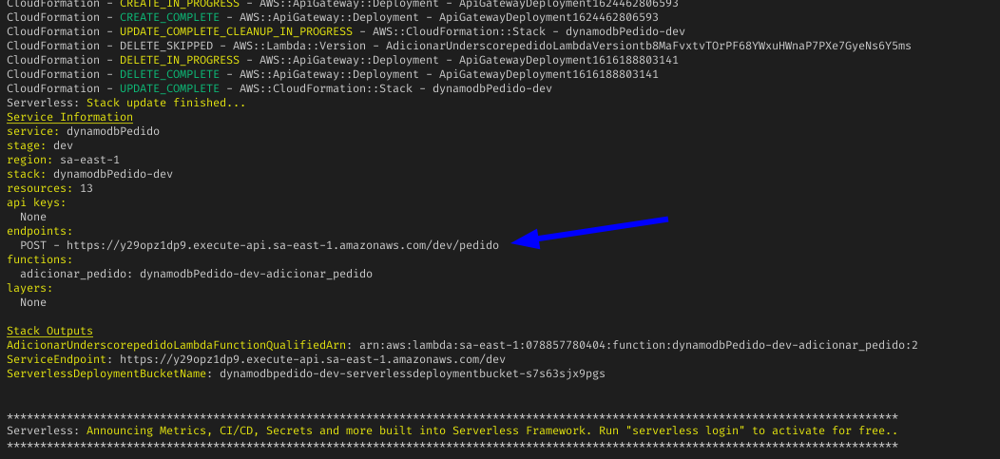
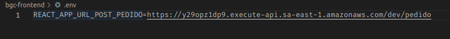

# Desafio GBC Loja (Backend serverless)

[Teste o site clicando aqui ;)](http://bgc-frontend.s3-website-sa-east-1.amazonaws.com/)

## Sumário

- [Requisitos](#requisitos)
- [Como usar](#como-usar)
- [Vídeos](#videos)

## Requisitos
[(ir para o sumário)](#sumário)

- [Serverless Framework](https://www.serverless.com/framework/docs/getting-started/)
- Git
- npm

```bash
sudo npm i -g serverless@2.29.0
```

## Como usar
[(ir para o sumário)](#sumário)

1. **Criar conta na AWS**

   Crie conta na aws e copie a KEY_API e SECRET_KEY [(veja esse vídeo, como exemplo, para obter as credenciais)](https://www.youtube.com/watch?v=KngM5bfpttA)

2. **Configuração do Serverless Framework**

   ```bash
   sls config credentials -o --provider aws --key=KEY_API --secret SECRET_KEY
   ```

3. **Clonando o projeto e configurando**

   ```bash
   git clone https://github.com/felippedesouza/bgc-backend-serverless.git
   cd bgc-backend-serverless/dynamodb_pedido
   npm install
   mv variaveis.exemplo.js variaveis.js
   ```

4. **Coloque seus dados de email em 'dynamodb_pedido/variaveis.js' (MAIL_SENDER, MAIL_USER e MAIL_PASSWORD)**

   **Nota:** caso use o Gmail, ative o modo [Less Secure Apps](https://devanswers.co/allow-less-secure-apps-access-gmail-account/)

5. **Fazer deploy da configuração do seu service e do seu código**

   ```bash
   sls deploy -v
   ```

5. **Conectando o frontend ao backend**

   Ao terminar o deploy, copie o endpoint do método HTTP .

   

   Cole em `.env` do [bgc-frontend](https://github.com/felippedesouza/bgc-frontend/blob/main/.env.exemplo)

   

6. **Por fim, execute `npm run start` no bgc-frontend**

## Videos
[(ir para o sumário)](#sumário)

<p align="center">
   <a href="https://youtu.be/_owP1BYJytY"> 
      Vídeo da versão 3.0 <br>
      
   </a>
</p>

<p align="center">
   <a href="https://youtu.be/kWpBPtolxFw"> 
      Vídeo da versão 2.0 <br>
      
   </a>
</p>